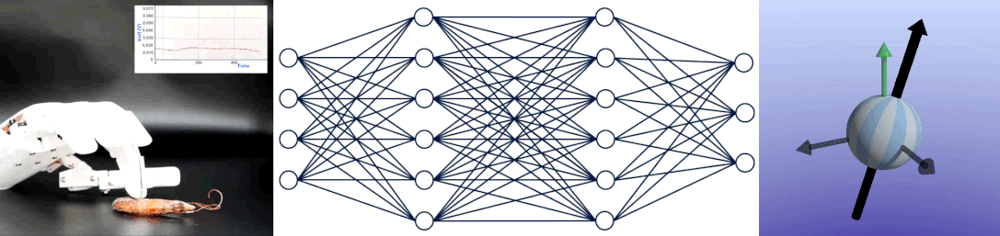
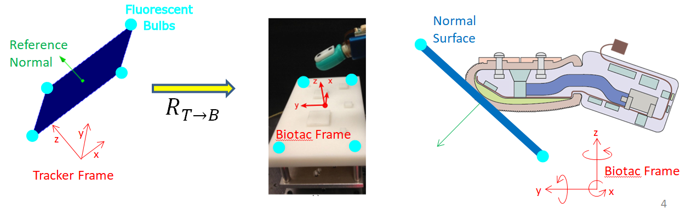
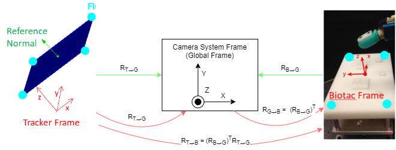
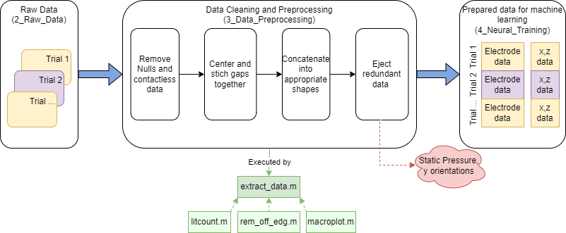
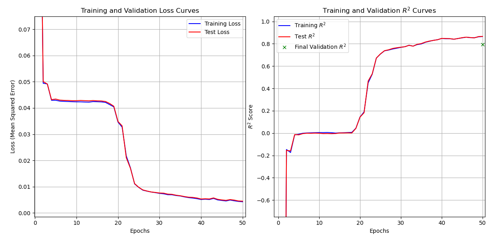

## Syntouch Biotac Robotic Finger: Deducing Force Direction

The Syntouch Biotac is a robotic finger with multiple electrode and pressure sensors that allow for tactile feedback. In this project, I created a neural network that takes in this sensor information and deduces the direction of a tactile force in real-time, mediated by ROS (ie, if the finger is touching something, it knows which direction the apparent force is coming from). 

[Run the Code!](#run-the-code)

### Table of Contents
- [Syntouch Biotac Robotic Finger: Deducing Force Direction](#syntouch-biotac-robotic-finger-deducing-force-direction)
  - [Table of Contents](#table-of-contents)
  - [Data Acquisition](#data-acquisition)
  - [Data processing](#data-processing)
  - [Machine Learning Approaches](#machine-learning-approaches)
    - [Multi-Layered Perceptron(Neural Network)](#multi-layered-perceptronneural-network)
    - [SVR (rejected)](#svr-rejected)
    - [GPR (abandoned)](#gpr-abandoned)
  - [Run the code](#run-the-code)

### Data Acquisition
---

### Data processing
---

### Machine Learning Approaches
---

#### Multi-Layered Perceptron(Neural Network)

#### SVR (rejected)
#### GPR (abandoned)

### Run the code
