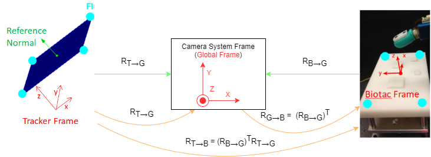
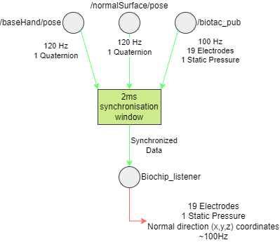
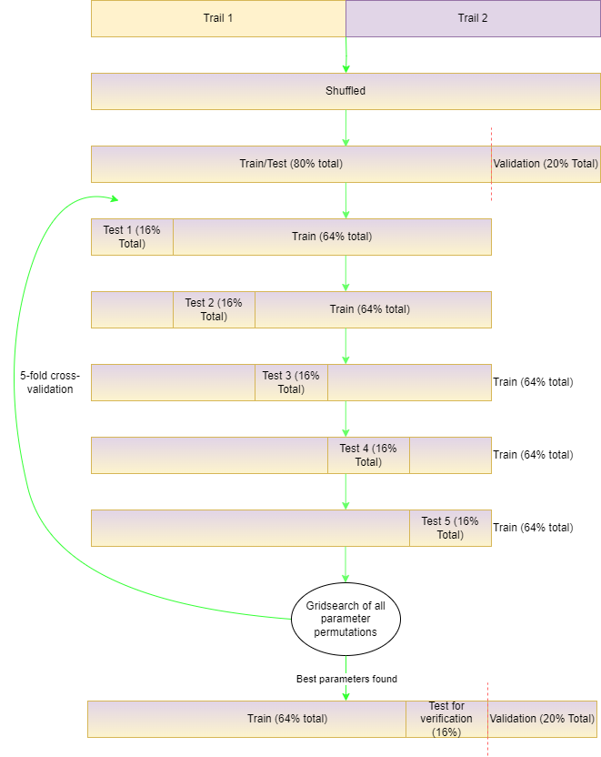

## Syntouch Biotac Robotic Finger: Deducing Force Direction

The Syntouch Biotac is a robotic finger with multiple electrode and pressure sensors that allow for tactile feedback. In this project, I created a neural network that takes in this sensor information and deduces the direction of a tactile force in real-time, mediated by ROS (ie, if the finger is touching something, it knows which direction the apparent force is coming from). 

[Run the Code!](#run-the-code)

### Table of Contents
- [Syntouch Biotac Robotic Finger: Deducing Force Direction](#syntouch-biotac-robotic-finger-deducing-force-direction)
  - [Table of Contents](#table-of-contents)
  - [Introdction](#introdction)
  - [Data Acquisition](#data-acquisition)
  - [Data processing](#data-processing)
  - [Machine Learning Approaches](#machine-learning-approaches)
    - [Framework for all approaches](#framework-for-all-approaches)
    - [Multi-Layered Perceptron(Neural Network)](#multi-layered-perceptronneural-network)
      - [The Original Solution](#the-original-solution)
      - [The Simplest, Most Elegant Solution](#the-simplest-most-elegant-solution)
      - [Closing Remarks](#closing-remarks)
    - [Support Vector Regression (SVR) - Rejected](#support-vector-regression-svr---rejected)
    - [Gaussian Process Regression (GPR) - Abandoned](#gaussian-process-regression-gpr---abandoned)
  - [Implemented Solution in ROS](#implemented-solution-in-ros)
  - [Thermal Noise \& Unwanted spurious effects](#thermal-noise--unwanted-spurious-effects)
  - [Run the code](#run-the-code)

### Introdction
---
The Syntouch Biotac contains a variety of sensors, of interest are the 

### Data Acquisition
---

### Data processing
---
After several trials of data acquisition, two were selected to be the dataset for machine learning purposes. These are [Trial 1](source/2_Raw_Data/biochip_listener_15330_1571242563995.log) and [Trial 2](source/2_Raw_Data/biochip_listener_15834_1571243162016.log). All other trials are found in the [Other_Raw_Unused](source/2_Raw_Data/Other_Raw_Unused/) folder. They were chosen because these trails lasted the longest, and gave an ample combined dataset of about 8000 points. The unused trials were used as a reference to make sure the data was being preprocessed correctly. But **note** that they are just as legitimate a dataset as Trials 1 and 2, albeit much smaller. Therefore they also serve as ample validation sets that are mutually unrelated(within the scope of the experimental setup). 
The goal of this part is to remove irrelevant/invalid information, and to concatenate the dataset into the appropriate shapes. This is done is five steps:
1. Moments when no contact was made with the surface of the Biotac are considered invalid. These were identified when the PDC(static pressure) fell bellow a minimum threshold, and we reject the corresponding data. Similarly, when the ROS nodes are first initialised, erroneous data gets recorded and must be removed. By symmetry, something similar happens when the nodes are terminated, the log files tend to mess up.
2. After removing null data, it was stitched together directly at the removed discontinuities. The Machine learning methods would not make a prediction whilst considering time, but uniquely on the electrode values, so temporal jumps didn't matter for learning.
3. The electrode sensors were not always consistent between the trials, they would measure slightly different readings for the same apparent force. Neglecting thermal noise, this effect was mitigated by centering(subtracting the mean) of the electrodes for a given trial. This allowed data from all the trials to be comparable.
4. For machine learning, I wanted to use supervised learning. Therefore, my feature space is composed purely of the electrodes(19), and the corresponding 'labels' are purely the (x,y,z) coordinates of the normal direction. For a given trial, a single sample of the electrodes defined a row of feature data. They were all stacked chronologically on top of each other, so a matrix of roughly $4000\times19$. Similarly, the corresponding (x,y,z) coordinates were also stacked chronologically, roughly of size $4000\times3$. **The $n^{th}$ row of the (x,y,z) matrix corresponds to the normal direction that caused the electrodes to measure the  $n^{th}$ row in the electrode matrix.** #TODO ADD VISUALISATION HERE
5. Since the normal direction is normalised, it is redundant to keep all of its components. Since $x^2+y^2+z^2=1$, knowing two of the components allows us to determine the third. I arbitrarily chose to eject the y component. Similarly, the static pressure is not necessary for machine learning, so it is also ejected.

The full data processing pipeline is visualised below:

The process is mediated by the script [extract_data.m](source/3_Data_Preprocessing/extract_data.m), and is largely automated. The other scripts, [litcount.m](source/3_Data_Preprocessing/litcount.m), [rem_off_edg.m](source/3_Data_Preprocessing/rem_off_edg.m), and [macroplot.m](source/3_Data_Preprocessing/macroplot.m) provide functions for repetitive utilities and debugging visualisations. 
We can visualise the structure of the fully prepared data below:
### Machine Learning Approaches
---
#### Framework for all approaches
All code relating to machine learning was done in the `SciKit-Learn` python package, except for GPR. This was done in MatLab using the `ML-toolbox` package. 
The main metric used to determine the goodness of fit for regression was the coefficient of determination, $R^2$. I seek to minimise model complexity for a performance of at least $R^2 = 0.7$, but ideally it would be more. The optimal model parameters were determined with a grid search. For a given gridpoint(a given permutation of hyperparameters), 5-fold cross validation was used to train/retrain a model, and extract the $R^2$ value for each test-fold in the 5-fold. The **median** $R^2$ value was chosen to represent the performance for _that_ permutation of hyperparameters. 
AIC was used as a way to discriminate against more complex models in a given gridsearch.  
Given that the AIC criterion tends to favour performance at the expense of greater model complexity, this metric was only indicative for my experiments. I would look at the permutation of hyperparameters that minimised AIC and manually explored if better alternatives were being obscured.  
Ultimately I wanted the simplest model with the highest performance, so relying on AIC alone is not sufficient. $R^2$ generally took precedence. The summary statistics & metrics for each point(model) in the gridsearch were saved in an `csv` file, and inspected when the gridsearch finished. An example file for the neural network is found [here](source/4_Neural_Training/hyperparameter_grid_search_overview.csv). The other included statistics are largely arbitrary, and were included "just because I could". They came with no computation cost and may have given some insight.  
Regression performance was important for this project(only models with $R>0.7$ were considered) so BIC was not considered as a discriminator.  
Given the datasets are composed of two trials, I decided to have a shuffled train/test/validation split of 64%/16%/20%. Tha train/test sets were used exclusively for the 5-fold cross validation, and once the best model was found, it was retrained on the same training set and finally tested against the validation set. Below we visualise this process:  

While this was conducted to the neural network and the SVR gridsearch permutations, the search of a simpler model required I change this approach for the neural network to make sure I was avoiding researcher over-fitting. This is discussed [here](#the-simplest-most-elegant-solution).

#### Multi-Layered Perceptron(Neural Network)

##### The Original Solution
The multi-layered perceptron had 19 input neurons, and 2 output neurons. The inputs are for a single data point from our X dataset, and the outputs are for the corresponding x and z coordinates, in the Y dataset. All layers in-between are conventional "square" layers, where there are L layers, and N nodes per layer, each layer fully connected to its previous and next layer. I used ReLu as the activation function across all neurons, except at the input and outputs(no activation function, just raw data) The hyerparameter search space is the following:
- $L \in [1,10]$
- $N \in [5,100]$
- $l \in [0.0001, 0.05]$

Where $l$ is the learning rate. A maximum of 500 epochs was allowed per training, and an adaptive learning rate was chosen. To make the gridsearch computationally feasible, it was chosen that the largest neural network does not exceed 1000 neurons. The AIC used is defined as: $AIC = 2L(N^2+N) -2ln(1-R^2)$. 
It does not consider the weights & biases of the input and output neurons. No matter which permutation of hyperparameters, the latter two will never vary, and they will never be directly connected to each-other.  
After examining the complete `cvs` [here](source/4_Neural_Training/hyperparameter_grid_search_overview.csv) for the entire range of hyperparameters, a good model with an $R^2=0.91$ in the x direction and $R^2=0.88$ in z direction was found for only 90 neurons (10 layers, 9 nodes per layer, tested against the validation set). Normally the project would have ended here, but the `csv` invited for a closer inspection to even simpler models.
##### The Simplest, Most Elegant Solution
Inspecting the `csv` file indicated that there may have been even simpler models that could model the data. Among the other statistics, the variance in $R^2$ was moderate for them, indicating there could be simpler models with good performance.  
Thanks to the fact that now the gridsearch would be restricted to a smaller range, and to smaller models, it was computationally feasible to experiment more finely. 
However, in the search for a simpler model, inevitably this invites the problem of researcher overfiting, ie: Is the model actually performing well on the validation set, or is it only performing well because I adjusted the parameters and/or trained/retrained to fit the data? 

In order to select candidate models, I limited the grid to the following ranges:
- $L \in [1,10]$
- $N \in [5,10]$
- $l \in [0.01, 0.02]$

Furthermore, during cross-validation, I recorded the **best** $R^2$ score for a given model, rather than its **median**. 
My reasoning is as follows: a good simpler model would perform well on the test/train/validation sets, whereas a simpler, overfited model would only perform well on the test/train sets, and poorly on the validation set. And since I had the computation power, I could filter out the overfited models and keep the remainder as candidates. 
After filtering them against the validation set, the best performing candidate had $L = 7, N = 5, l= 0.014$. 
It important to note that the weights and biases were never saved during the search.

To put this final candidate to the test, the issue of researcher overfitting was dealt with in two ways:
1. Only data from trial 1 would be used for testing/training: While all trials used the same equipment, each trial was performed by different people under different conditions(room temperature, lighting, time, etc...). So to eliminate the possibility that the model was learning environmental queues, it has to perform comparably well on a different trial as it did from the one it learned from. This would confirm that it's actually picking up the underlying pattern for regression.
2. A severe train/test ratio of 50%: Limiting the training data while maintaining good test performance indicates the model is correctly learning the underlying pattern.

The net effect was that the candidate model used only 25% of the entire dataset for training, 25% for testing, and an unrelated trial(which it was never exposed to and was 50% of the entire dataset) for validation. This is visualised below:

Since the weights were never saved during the gridsearch, the purpose of the retraining loop was to re-converge back to the good weights. It could be the case that the objectively good weights are few, and the overfitting ones are many, but we have the computation power to try. Luckily they did converge properly. 
The final performance is demonstrated bellow with a final $R^2$ of 0.8 on the validation set(averaged out on the x and z directions).

Similarly, the loss curve and $R^2$ curve also represent the x-z average.
We see that the testing loss closely follows the training loss, indicating it is properly picking up the desired pattern. Finally, a very comparable performance on the final validation set certifies that this simpler model is correctly predicting the data. It has correctly predicted the behaviour of unrelated and unseen data. 
Overall, the model complexity was reduced by almost 66% for a loss in performance of 9%. 
It would have been enough to stop at the model of 90 neurons, but curiosity got the better of me.

##### Closing Remarks
One could argue that I could repeat the train/retrain loop in the simpler model until I eventually researcher overfited into good performance in the validation set. I also experimented with this. About 50% of the time it gives good results, and the other 50% it performs poorly on the validation set. I argue it is not overfiting on the good 50% since ultimately the model trained on only 25% of the dataset, and was validated against unrelated(different trial) data.  
However it does demonstrate the inherent stochastic nature of neural networks. Even if I performed this same experiment with the 90 neuron model, perhaps it would validate well 95% of the time, but poorly on the 5%. Even though we know the 90 neurons is an objectively good model, at what point should we say it has become researcher overfit? When it only validates 70% of the time? 30% ? An interesting question, but for practical purposes, only the context can inform us. In this case, the Syntouch Biotac will never experience a positive z coordinate(the electrode sensors are only on one side of the finger), and all coordinates are constrained by their normalisation. Even if it was overfiting outside these ranges, there's no way to know as these ranges will never be achievable. In that case, overfiting does not matter. An interesting thing to think about. Perhaps its more useful to define overfiting as 'Not Underfiting' rather than just poor validation performance. 
#### Support Vector Regression (SVR) - Rejected

Since SVR was not the final implemented solution, the relevant code has been redacted in favour of the neural network. However, it's worth discussing the main insights, choices, and results. 
Similar to the neural network, I grid-searched over the hyperparameters to find the best ones. After experimentation, an `RBF` kernel was used. 
The following ranges were used:
- $\epsilon \in [0.05, 0.2]$ Tolerance for noise
- $C \in [1, 5000]$ Penalty for outliers
- $\gamma \in [10^{-5}, 10^{-4}] \Leftrightarrow \sigma \in [70, 223]$ RBF kernel width

**NOTE**: After discussion with colleagues and the rest of the lab, it was determined that the number of support vectors should **Not** exceed 20-30. The reasoning for this was based on past experience & experiments from others. There was no concrete mathematical reasoning given to me, so I took this range 'as-is'.  
The `AIC` for SVR is not directly applicable, thus the use of cross-validation and $R^2$ to determine the final model.  Never-the-less. I'd like to define an AIC-like metric that roughly   encapsulates both the complexity and performance of SVR. Therefore, I define my pseudo-AIC as $AIC_{pseudo} = -\alpha ln(1-R^2) + S_v N^2$ where:
- $R^2$ is the usually defined coefficient of determination
- $S_v$ is the number of support vectors of the model
- $N$ is the dimensionality of the dataset (19)
- $\alpha$ is a tunable parameter that can adjust the importance of predictive power and model complexity.

Tuning $\alpha$ is down to experimentation, however it should favour model performance when $S_v \in [20, 30]$.  
My $AIC_{pseudo}$ should **not** be used to compare the SVR models against the Neural Networks. In the latter case I used the appropriate formula for multi-layered perceptrons, but in the former case it's a guess/estimate of what it may look like.  
Ultimately the best models after the gridsearch and cross-validation did not yield satisfactory results.

We can see the $R^2$ is no where near satisfactory for a maximum of 30 support vectors. Ideally an $R^2 \gt 0.7$ would have merited further investigation. However for $R^2 = 0.68$ we need 51 support vectors in the x-direction, and 81 in the z-direction. Therefore an SVR model was rejected for this project.
#### Gaussian Process Regression (GPR) - Abandoned

I also attempted Gaussian Process Regression as a way to compare it against the performance of the other models. It became very apparent very quickly that this wasn't the way to go.  
The modelling was very sensitive to choices on the priors despite popular approaches.  
To get it to work required tightly constraining priors, however this significantly increases the likelihood of researcher overfiting to get acceptable results. Rather than spending the computation time grid-searching for small islands of acceptable performance(which ultimately were very close to each other), this approach was abandoned. 

### Implemented Solution in ROS
---

### Thermal Noise & Unwanted spurious effects
---
A known issue was thermal noise during the use of the finger. Once turned on, the changing internal temperature would vary the readings of the electrodes, and slightly change the viscosity of the internal mediating fluid (thus affecting the static pressure readings). If left unaccounted for, it would cause the predicted x,y,z coordinates of the normal force to drift. 
So for example, if you pressed the finger perfectly in the middle in the perpendicular direction, the predicted normal force would gradually drift away as the finger warmed up. 
To robustly deal with this requires a proper analysis and implementation of noise mitigation efforts. This was not in the scope of the project, so it was dealt with as follows: 
After powering on the finger and connecting it to ROS(but before starting the neural network node), wait 20 minutes for it to warm up. It will be in thermal equilibrium with the environment. Then, start the neural network node and it will run the calibration process. Since the finger is already in thermal equilibrium, there will be no thermal drift. 
This works very well when the finger is put in contact with thermally insulating materials, but I suspect it will begin to drift when pressed against thermally conducting materials. They will draw out the heat from the finger and lower the internal temperature, inducing a reversed drift. 
This was never experimented upon further as it was outside the scope of the project. Letting the finger warm up and only using wood/plastic/etc.. surfaces was sufficient to nullify thermal drift for the interests of this project.
### Run the code
